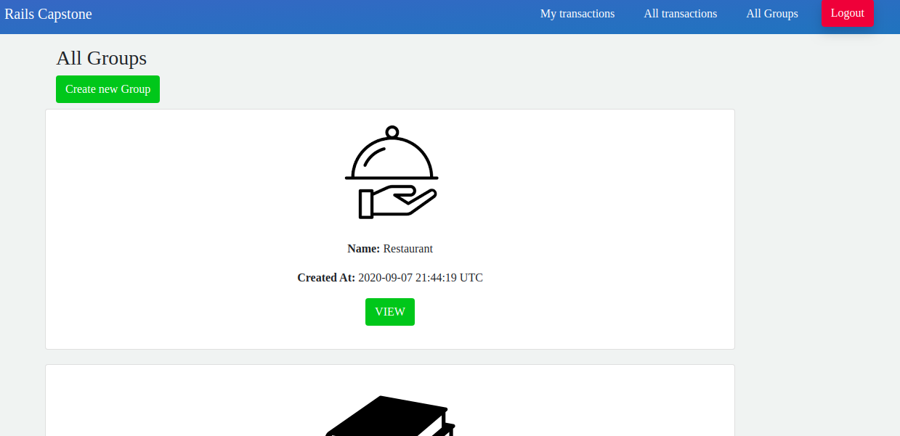

# Rails-Capstone

This Ruby on Rails capstone is based on an app for grouping payments by goal with your family/friends.

## Built With

- Ruby 2.7.1
- Rails 6.0.3.2
- VS Code

## Prerequisites
In order to make the program work, you need to have ruby interpreter installed in your system. You can get the latest version of ruby from [official website](https://www.ruby-lang.org/en/downloads/).

## Getting Started 

1. clone the project

- Open your git bash

# Clone this repository
$ git clone https://github.com/tGodson/rails-capstone.git

# Go into the repository
$ cd rails-capstone

# make sure you have ruby 2.7.1
# install gems from Gemfile using bundle
$ bundle install

# migrate table to database

$ rails db:migrate

## Usage

_you can create a user by clicking on the signup button at the top right of your screen and fill the sign up form

_You can sign In by clicking on the sign In button at the top right of your screen and filling the form

_You can create an transaction when you are logged In by clicking on the `ADD NEW` Butoon at the bottom of `my transction page` and fill the form

## Author

👤 **Tendongze Godson**
- Github: [tGodson](https://github.com/tGodson)
- Twitter: [@tendongze95](https://twitter.com/tendongze95)
- Linkedin: [linkedin](https://www.linkedin.com/in/tendongzegodson)

## 🤝 Contributing

Contributions, issues and feature requests are welcome!

[issues page](https://github.com/tGodson/rails-capstone/issues)

## Show your support

Give a ⭐️ if you like this project!

## Acknowledgments
 
- [The Odin Project](https://www.theodinproject.com/)